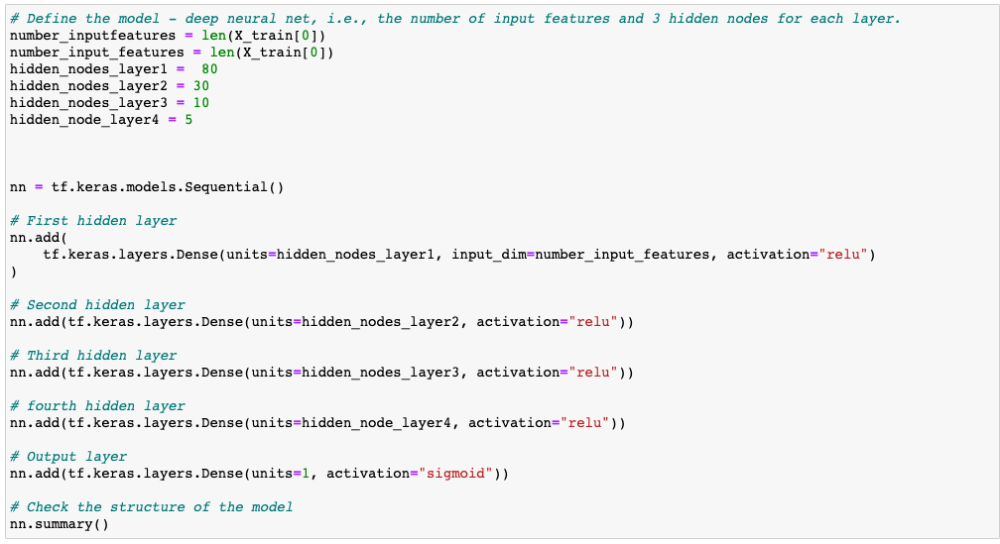
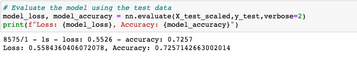
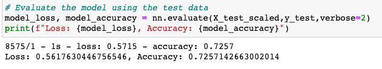

# Neural_Network_Charity_Analysis
Creating a Neural Network Model for charity data. 
 

Tyrone Fraley 
UC Berkley Extension 
Jan 11, 2023 

 

  

 

## Overview
As the data analyst for this project I used neural network and machine learning to create a binary classifier that would have the capabilities to predict whether applicants could be successfully funded by Alphabet Soup. To complete this task I used TensorFlow and Pandas to properly develop my ML model and neural network. The CSV file for this project included more than 34,000 organizations. All of which have received funding from Alphabet Soup. Each organization's meta data is included in the CSV variables such as: name, application type, affiliation, classification, use case, organization, status, income amount, special considerations, ask amount, and is successful (if their money was effectively used). 
The neural network model for this analysis was first built in a file called AlphabetSoupCharity.ipynb. This is where all preprocessing and development of the neural network model would take place. After this was completed I then created a second file known as AlphabetSoupCharity_Optimization.ipnyb to attempt to optimize the neural network model.

## Results

* Data Preprocessing 
    * Targets: The target variable for this neural network model was the "Is_Successful" column.
    * Features: The feature selected for this neural network model was the "Is_Successful" column.
    * Removable Data: The identification columns (EIN and NAME) were both columns that were removed from the data set, because they had no place in the vision of this neural network model as they are not targets nor features.
* Compiling, Training, and Evaluating the Model
    * Composition of the Model: The model was comprised of 125 neurons, four hidden layers, and ReLu as an activation function. In addition, epochs were adjusted as follows: 100, 200, and finally 50. This was an attempt to optimize performance.
    
 

  

 
    * Target Model Performance: Unfortunately, the model was not able to meet a performance of 75% or above. Originally, the model was built with three layers and 30 neurons. Model performance was around 72% at this point and after adding more factors to assist in performance the model reached 72%.
    * Increase Model Performance: To increase model performance I used four hidden layers, added 125 neurons, and at one point changed some activation functions to tanh; however this did not assist the model in performing over 75%.
    

Non Optimized Model

 

  

 

Optimized Model

 

  

 

## Summary
The final accuracy score for this model was 72%. The model was not able to achieve a score of over 75%. For future use of this model I would recommend using a random forest classifier. This is due to the random forest classifier being able to utilize feature bagging, assess missing values, and sustain accuracy when some values may be missing, (IBM, 2023).

Reference:
IBM. (2023). What is a Random Forest. https://www.ibm.com/topics/random-forest#:~:text=Key%20Benefits&text=Feature%20bagging%20also%20makes%20the,or%20contribution%2C%20to%20the%20model.

